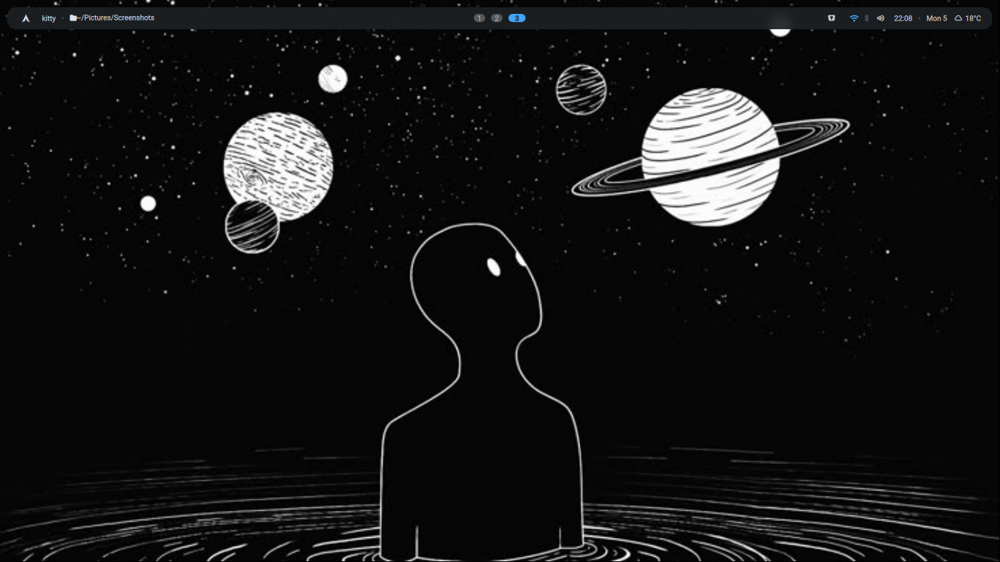
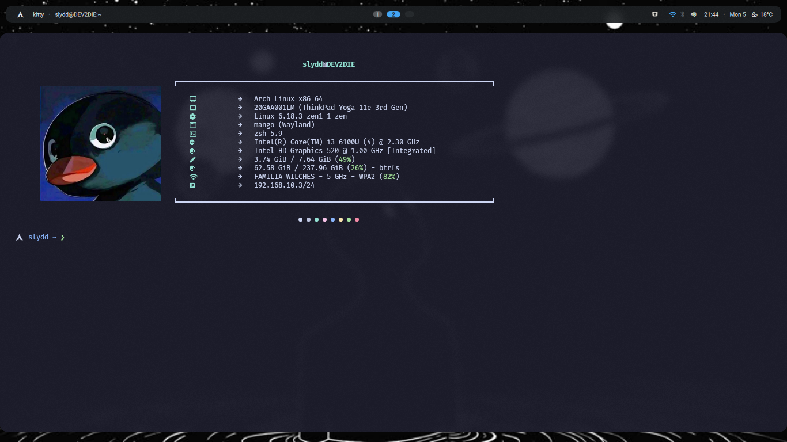
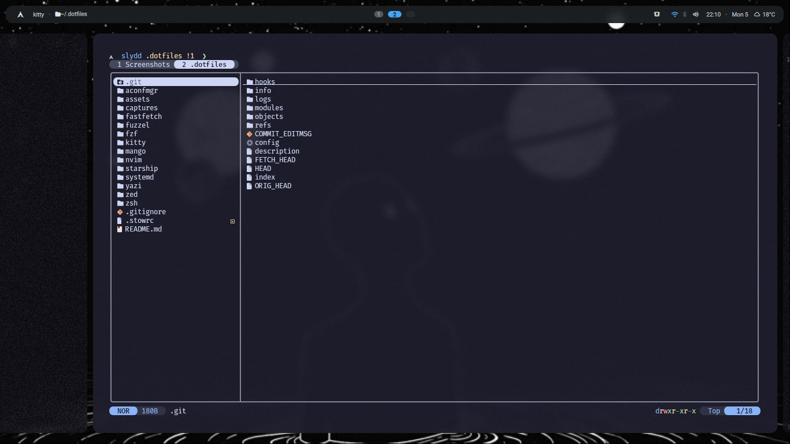

<h1 align="center">✨ Slydd Dotfiles ✨</h1>
<p align="center">
  
</p>
<p align="center">
  <b>My personal Arch Linux setup</b>
</p>

---

This repository contains my personal dotfiles for Arch Linux, organized and managed with [aconfmgr](https://github.com/CyberShadow/aconfmgr) and [GNU Stow](https://www.gnu.org/software/stow/). Here you'll find configurations for my graphical environment, terminal tools, scripts, and more—focused on productivity, aesthetics, and maintainability.

---

## ⚙️ System Specs

- **Distribution:** Arch Linux
- **Kernels:** Mainline, Zen
- **Declarative Package Manager:** [aconfmgr](https://github.com/CyberShadow/aconfmgr)
- **Symlink Manager:** [GNU Stow](https://www.gnu.org/software/stow)
- **AUR Helper:** paru
- **Window Manager:** [MangoWC](https://github.com/DreamMaoMao/mangowc)
- **Widgets & Desktop Shell:** [DMS (Dank Material Shell)](https://danklinux.com/docs)
- **App Launcher:** fuzzel
- **Terminal:** kitty + zsh + starship
- **File Manager:** nemo, yazi
- **Login Manager:** ly
- **Themes:** Orchis (GTK), Bibata (cursor), Kora (icons)
- **Font:** FiraCode Nerd Font

---

## 🖥️ Screenshots

<p align="center">
  
  
  
</p>

---

## 🚀 Installation Guide

### 1. Clone this repository

```sh
git clone https://github.com/slydd/dotfiles.git ~/.dotfiles
cd ~/.dotfiles
```

### 2. Install prerequisites

With paru:
```sh
paru -S stow aconfmgr-git
```
With yay:
```sh
yay -S stow aconfmgr-git
```

### 3. Link dotfiles using stow

```sh
stow .
```

### 4. Sync system packages & system-level configs

```sh
aconfmgr apply
```

### 5. (Optional) Enhance your shell: Oh My Zsh & Plugins
> **Tip:** If you dont want use ohmyzsh or any plugin modify `plugins=(...)` array and `ZSH` var in `dotfiles/zsh/.zshrc`.

- **Install [oh-my-zsh](https://ohmyz.sh):**
  ```sh
  sh -c "$(curl -fsSL https://raw.githubusercontent.com/ohmyzsh/ohmyzsh/master/tools/install.sh)"
  ```
- **[zsh-autosuggestions](https://github.com/zsh-users/zsh-autosuggestions):**
  ```sh
  git clone https://github.com/zsh-users/zsh-autosuggestions ${ZSH_CUSTOM:-~/.oh-my-zsh/custom}/plugins/zsh-autosuggestions
  ```
- **[zsh-syntax-highlighting](https://github.com/zsh-users/zsh-syntax-highlighting):**
  ```sh
  git clone https://github.com/zsh-users/zsh-syntax-highlighting.git ${ZSH_CUSTOM:-~/.oh-my-zsh/custom}/plugins/zsh-syntax-highlighting
  ```
- **[fzf-tab](https://github.com/Aloxaf/fzf-tab):**
  ```sh
  git clone https://github.com/Aloxaf/fzf-tab ${ZSH_CUSTOM:-~/.oh-my-zsh/custom}/plugins/fzf-tab
  ```

### 6. Set Zsh config folder to `.config/zsh`

```sh
echo "ZDOTDIR=~/.config/zsh" >> ~/.zshenv
```
